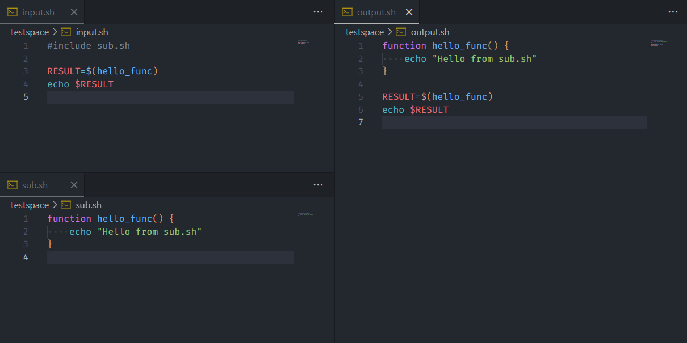

# shrup - A shell script preprocessor

**Simple, Fast, Lightweight** shell script preprocessor

- Simple → シンプルでトリセツのいらない仕様
- Fast → Rust製故の超高速な処理
- Lightweight → 1kB未満のバイナリサイズ

自分用に作成したシェルスクリプト作成支援ツールです。
C言語のプリプロセッサーのように、ファイル内の`#include`ディレクティブを解決して結合できます。
一応シェルスクリプト以外でも使えます。

## スクリーンショット


## 機能

- 循環参照検出
- デバッグモード（`--debug`でincludeコメント表示）

## ディレクティブ

- `#include <file>` → ファイルを解決して結合

## インストール方法

```bash
cargo install shrup
```

## 使用方法

```bash
shrup input.sh output.sh [--debug] [--max-depth N]
# --debug, -d → デバッグモード（includeの情報を出力に含める）
```

## ビルド

```bash
cargo build --release
# バイナリは target/release/shrup に生成されます
```

## テスト

```bash
cargo test
```

### Include記法

```bash
#include <utils/functions.sh>    # 山括弧
#include "config/settings.sh"    # ダブルクオート  
#include 'helpers/logger.sh'     # シングルクオート
#include common.sh               # クオートなし
```

## ライセンス

MIT License